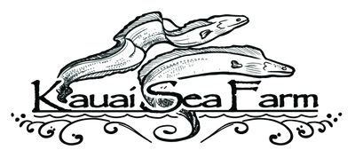

# Welcome: Visual Data Exploration Tool
This dashboard visualizes the biogeochemical, physical, and aquacultural productivity data of the Nomilo fishpond, operated by [Kauaʻi Sea Farm (KSF)](https://kauaiseafarm.com/), to monitor its ecosystem and make informed management decisions aimed at restoring the fishpond and improving aquacultural productivity amid climate change. This fieldwork was performed as part of Research Question 2 of the Master thesis research. 

#### Datasets

The main data sets to explore involve:

1.  Water Sampling
2.  Profiles
3.  Clam growth
4.  Oyster growth
5.  Weather
6.  KSF Data

These data are simulated at four locations on the fishpond and at depths ranging between 0.5m and 7.5m. The locations involve: (1) Back Buoy, (2) Mid Buoy, (3) Production Dock, and (4) Auwai.

In the interactive elements you can select parameters for each data sets. Positioning various parameters side-by-side can help visualize possible trends. For example, look at how increase of large phytoplankton count (Water Samples Data) only occurs afer a change in wind direction (Weather Data). Explore yourself or read on about the results of the fieldwork below. 

#### Fieldwork: Main Findings (Research Question 2)

Hawaiian fishpond restoration projects and research have shown that biogeochemical imbalances in water quality are inhibitors to aquacultural productivity and overall ecosystem health. The current understanding of fishpond ecosystems is limited in terms of pond diversity and the expected impact on aquacultural productivity. Hawaiian fishponds are diverse and influenced by many environmental, physical, biological, and anthropogenic forces (Lechner et al., 2022). Knowledge gaps exist in the extrapolation of these findings to other fishpond systems and overall inclusion of biogeochemical parameters. Furthermore, only few studies have linked water quality to aquacultural productivity. Therefore, the aim of RQ2 is to measure the biogeochemical and physical dynamics of Nomilo fishpond over time and space, and how these dynamics in turn influence clam and oyster growth.

##### Research Questions

It does so based on the RQ2: How do the dynamics between key biogeochemical variables, physical variables and aquacultural productivity change over time and space? To address each component of the research question accurately, RQ2 is split into two parts. RQ2a states: How do the dynamics between key biogeochemical and physical variables change over time and space?. RQ2b follows up on how these dynamics then relate to the economic productivity of Nomilo fishpond by posing the question: How do the biogeochemical and physical dynamics of the fishpond relate to growth and harvest of aquaculture?

##### Methodology

To better understand these fishpond ecosystem dynamics, this research analyzed biogeochemical and physical dynamics of a fishpond over time and space, and how these dynamics influenced clam and oyster growth. In a case study on Nomilo fishpond, 5 rounds of water sampling and profiling on 4 spatial locations at depths ranging from 0.5m -- 7.5m were taken to collect data on chlorophyll-a, nutrients, flow cytometry, conductivity, dissolved oxygen, temperature, salinity, and dissolved oxygen. This data was combined with weather data, clam growth, oyster growth, and additional water quality data to perform exploratory and correlational analysis in R-studio.

##### Main Findings

The main finding can be summarized into four statements that chronologically explain the biogoechemcial dynamics and aquacultural productivity at Nomilo fishpond during the critical winter period (November 2023 till February 2024): (1) First, reversed wind direction from North/North-East to Westernn wind induced enhanced intercolumn mixing dynamics of Nomilo fishpond, creating reversed mixing conditions that stimulate water turnover. (2) Second, benthic and deep-water conditions might be a good determiner of what drives changes in aquacultural productivity during winter. Groundwater levels could play a role by pushing nutrients from the anoxic 7.5m sediment into the water-column. (3) Third, reversed mixing dynamics induced by wind had beneficial cascading effects throughout the fishpond ecosystem in that it spread nutrients spatially and throughout the water columns, which supported increased concentrations of larger phytoplankton. (4) Fourth, aquacultural productivity of clams and oysters in terms of growth and survival rate improved after reversed mixing dynamics, consistent with increased phytoplankton abundance.

{fig-align="center" width="200"}    
{fig-align="center" width="200"}    
{fig-align="center" width="200"}    {fig-align="center" width="200"}

**Created By**: Alemarie Ceria   
**Last Updated**: 05/05/2024    

*© 2024 Oleson Lab, University of Hawaii at Manoa*
